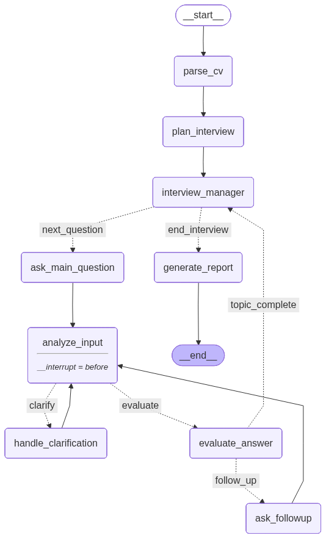

# 🎙️ AI Technical Interview Agent

An advanced, non-linear AI interview simulator built with **LangGraph** and **Google Gemini**. 

Unlike standard linear chatbots, this agent uses a dynamic state graph to simulate a realistic technical interview. It parses a candidate's CV, dynamically generates a custom interview agenda, evaluates answers in real-time, handles clarifying questions, and drills down with follow-ups when answers lack depth.



## ✨ Features

* **Dynamic Agenda Planning:** Reads a PDF CV and generates a tailored interview plan focusing on the candidate's specific skills.
* **Non-Linear Conversation Flow:** Powered by LangGraph, the agent intelligently routes between asking questions, handling candidate clarifications, evaluating answers, and asking follow-ups.
* **Structured Output Evaluation:** Uses Pydantic and Gemini's structured outputs to rigidly score answers and determine if follow-up questions are required.
* **Stateful Memory:** Maintains conversational context and interview progress across the entire session.
* **Comprehensive Reporting:** Generates a private, detailed interviewer report at the end of the session with scores and feedback for each topic.

## 🏗️ Architecture

The application is built using a state-machine architecture via LangGraph. 

1.  **Setup Phase:** Parses CV $\rightarrow$ Plans Topics $\rightarrow$ Initializes Manager.
2.  **Execution Loop:** * Asks a question.
    * Analyzes intent (Did the user answer? Or ask for a hint?).
    * Routes to either Clarification or Evaluation.
    * Evaluator decides if the topic is complete or if a drill-down follow-up is needed.
3.  **Conclusion Phase:** Compiles scores and generates a final report.

## 📂 Project Structure

```text
ai-interview-agent/
│
├── README.md                 # Project documentation
├── requirements.txt          # Python dependencies
├── .env.example              # Example environment variables
├── .gitignore                # Git ignore rules
│
├── main.py                   # Application entry point (CLI or Streamlit UI)
│
├── config/                   # Configuration settings
│   ├── settings.py           # App-wide settings
│   └── llm_config.py         # Gemini LLM initialization
│
├── graph/                    # LangGraph core logic
│   ├── state.py              # TypedDict/Pydantic state definitions
│   ├── builder.py            # Graph compilation and edge definitions
│   ├── routers.py            # Conditional routing logic
│   └── memory.py             # Checkpointer / session memory
│
├── nodes/                    # Individual graph nodes
│   ├── parse_cv.py           
│   ├── plan_interview.py     
│   ├── manager.py            
│   ├── ask_question.py       
│   ├── analyze_input.py      
│   ├── clarification.py      
│   ├── evaluate.py           
│   ├── followup.py           
│   └── report.py             
│
├── services/                 # External integrations & tools
│   ├── pdf_loader.py         # PyPDF integration
│   ├── link_extractor.py     # Web scraping for portfolio links
│   ├── cv_parser.py          # CV text chunking/cleaning
│   └── speech_service.py     # STT / TTS integrations
│
├── prompts/                  # LLM Prompt templates
│   ├── interview_prompts.py  
│   ├── evaluation_prompts.py 
│   └── planner_prompts.py    
│
├── utils/                    # Helper functions
│   ├── logger.py             # Custom logging format
│   ├── debug_view.py         # Graph debugging tools
│   └── helpers.py            
│
├── data/                     # Local data storage
│   ├── sample_cv/            # Test PDFs
│   └── outputs/              # Generated reports
│
├── notebooks/                # Jupyter notebooks for prototyping
│   └── experimentation.ipynb 
│
└── tests/                    # Unit and integration tests
    ├── test_graph.py         
    ├── test_nodes.py         
    └── test_cv_parser.py
```

## 🚀 Getting Started

### Prerequisites:
> python 3.10+

> Google Gemini API Key

### Installation
Clone the repository:

    git clone [https://github.com/yourusername/ai-interview-agent.git](https://github.com/yourusername/ai-interview-agent.git)
    cd ai-interview-agent

Create a virtual environment:

    python -m venv venv
    source venv/bin/activate  # On Windows use `venv\Scripts\activate`
Install dependencies:

    pip install -r requirements.txt
Set Environment Variables: Google API Key.
cp .env.example .env

Inside .env:

    GOOGLE_API_KEY=your_gemini_api_key_here
### Usage:

Run the application:

    python main.py

(If you are using Streamlit for the UI, run streamlit run main.py instead).

## 🛠️ Technologies Used
* LangGraph: For orchestrating the non-linear interview state machine.

* LangChain: For prompt management and document loading.

* Google Gemini API: Powered by gemini-2.5-flash-lite for high-speed, structured reasoning.

* Pydantic: For strict structured output validation from the LLM.

* Streamlit: (Optional) For the interactive web UI.


## 📫 Contact
As an AI Researcher, I am always open to collaboration.
- **GitHub:** [SaibHossain](https://github.com/Saibhossain)
- **LinkedIn:** [SaibHossain](https://www.linkedin.com/in/saib-hossain-182834229/)